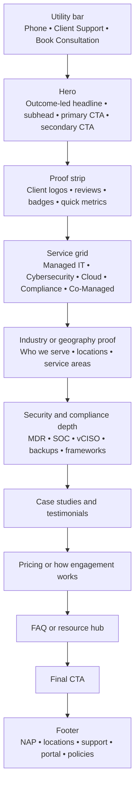
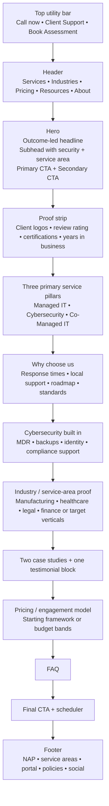

# MSP Website Benchmark Report

## Executive summary

This report defines the research population as Cloudtango’s **Top Managed Service Providers in the United States 2026** list, a 100-company MSP cohort that Cloudtango says it selected for technical excellence, innovation, customer satisfaction, and strength across cybersecurity, support, infrastructure, and AI, especially for providers serving SMBs and SMEs. To avoid anchoring on a single ranking source, the findings were triangulated against other current market-recognition sources, including Clutch’s managed IT rankings, Channel Partners’ MSP 501 coverage, and CRN’s MSP 500 list. citeturn4view0turn0search2turn0search1turn0search11

The strongest MSP homepages are not the ones with the most pages, the most jargon, or the biggest certification grid. They are the ones that move visitors through a simple buying sequence: **business-outcome headline → immediate trust/proof → clear service architecture → cybersecurity/compliance credibility → social proof → consultation CTA**, while keeping **client support/login** available but visually secondary. That flow appears in different forms on sites like ITS, centrexIT, CCB Technology, Corsica, Integris, Net Friends, and Managed Solution. citeturn13view3turn14search2turn17search0turn13view1turn24search7turn20search12turn14search1

Across the deeper 30-site audit, the most durable hero pattern was **outcome-led messaging framed in plain English**, often paired with security as a trust layer rather than the entire headline. The best examples include ITS’s “Future-Proof IT Support That Scales With Your Success,” centrexIT’s “We manage IT and Cyber so you can run your business,” and Integris’s “Book a discovery session” framing that leads with business alignment rather than commodity support. The weakest pattern was undifferentiated “we do IT” language or overly aggressive, pain-first copy that sounded interchangeable with generic MSP templates. citeturn13view3turn14search2turn19search6turn18search0

**Public pricing remains uncommon.** In the audited sample, a minority of sites exposed a pricing path at all, and only a smaller subset published concrete price guidance. The more credible transparent implementations used one of four patterns: a pricing CTA with an instant estimate or consultation workflow, range-based educational articles, pricing logic explained without exact rates, or tier naming without fully public numbers. ITS, Net Friends, Executech, Cyber Advisors, Omega, Magna5, and Integris are representative of those patterns. citeturn23search4turn23search0turn23search5turn23search17turn19search15turn23search14turn23search19turn20search13turn24search12

**Cybersecurity is now part of the MSP baseline story, not a side offer.** The leading sites increasingly frame security as embedded in the managed service model: cyber-first operating models, always-on monitoring, MDR/SOC capabilities, compliance-as-a-service, vCISO or advisory layers, and security guarantees. That posture is especially visible on Logically, Corsica, Scarlett Group, Omega Systems, Cyber Advisors, ITS, and R2 Unified. citeturn17search1turn17search13turn13view1turn14search7turn20search1turn21search2turn13view3turn15search14

For your MSP site, the highest-confidence recommendation is to build a **Midwest SMB-focused homepage** around one primary promise:

**Managed IT and cybersecurity that keep your team productive, protected, and ready to grow.**

Then support that promise with a **two-CTA hero**, a **3-to-6 service grid**, a **security/compliance section that proves security is built in**, a **small but visible pricing pathway**, and a **utility-nav client support/login link** that helps current clients without stealing conversion attention from prospects. The recommendation is based on the strongest conversion patterns observed in the audited MSP cohort. citeturn13view3turn14search2turn20search12turn24search7turn13view1turn17search1

## Research basis and methodology

The research base was the **100-company Cloudtango U.S. MSP Select 2026** list. Cloudtango explicitly states that its 2026 U.S. MSP analysis emphasized cybersecurity, support, infrastructure, AI-assisted efficiency, business growth, and customer satisfaction, and that the list showcases MSPs serving SMBs and SMEs with strong customer outcomes. citeturn4view0turn5view0turn6view0turn7view0

A deeper primary-source audit was then performed on a **30-site representative sample** drawn from the top-ranked portion of that list, because your goal is not merely to know who is highly rated as a provider, but to understand how the most visible MSPs currently structure their websites. The primary sources prioritized were official homepages, service pages, pricing pages, contact/support pages, and—in limited cases—Cloudtango provider profiles for structured service, award, or certification details. Cross-check sources included Clutch, CRN, and Channel Partners only for market-validation context, not for website-pattern conclusions. citeturn4view0turn0search2turn0search11turn0search1

This report is strongest on the following attributes because they were directly observable from primary sources: hero messaging, CTA labels, service architecture, pricing visibility, support/login surfacing, social proof styles, local wording, and cybersecurity framing. It is more conservative on two dimensions: **rendered mobile behavior** and **schema implementation on every site**, because the research environment exposed parsed page content rather than full browser devtools on each domain. Where mobile or schema behavior is inferred rather than directly verified, that is stated explicitly. Google’s own documentation confirms that `LocalBusiness`, `Organization`, and `FAQPage` structured data can help Google understand content and business details, but also notes that structured data does not guarantee rich results; Google also narrowed FAQ rich-result behavior in 2023, so schema should be treated as support for understanding, not as a guaranteed SERP enhancement. citeturn26search0turn26search1turn26search2turn26search6turn26search7

**Open questions and limitations.** Exact pricing was frequently gated or absent; some client portals were visible only on support pages rather than homepages; rendered homepage screenshots were not consistently available in this environment; and full per-site validation of structured data markup, keyboard behavior, and mobile menu interaction was outside the scope of this text-first audit.

## Findings across the top MSP sample

The visual pattern below summarizes the most common homepage sequence observed in the stronger MSP sites.



**Common homepage structure.** The strongest sites follow a disciplined order. The hero is usually followed quickly by some kind of proof layer: metrics, logos, reviews, badges, or a credibility strip. Then comes a service grid, usually with three to six primary offers. Security/compliance is either embedded in those cards or broken out into its own section. Mid-page or lower-page content then adds vertical-market proof or local-area proof, followed by testimonials or case studies, and a final “book / talk / assess / contact” CTA. This sequencing is visible on ITS, centrexIT, CCB Technology, Corsica, Magna5, Integris, and Net Friends. citeturn13view3turn14search2turn17search0turn13view1turn15search3turn24search7turn20search12

**Strongest hero messaging patterns.** The best MSP hero copy rarely says only “Managed IT Services.” Instead, it leads with a business result or operating state. Examples include “Future-Proof IT Support That Scales With Your Success,” “We manage IT and Cyber so you can run your business,” “Secure, Streamline, and Succeed with Confidence,” and “Focus on running your business. Net at Work manages the tech.” Security-first brands sometimes compress the message even further, as with Cyber Advisors’ “We Secure Your Business” or Logically’s “cyber-first” positioning. The common formula is: **result + relief of burden + security reassurance + human CTA**. Pain-led exceptions exist—NetEffect’s copy is a clear frustration-led example—but the overall market is moving toward calmer, strategic, business-language framing. citeturn13view3turn14search2turn22search0turn14search0turn21search0turn17search1turn18search0

**Hero CTA patterns.** The most persuasive homepages pair a primary “talk to us” CTA with a secondary qualification CTA. Good examples include **Schedule a Meeting / See Pricing** on ITS, **Start Your Free Assessment / Schedule a Conversation** on centrexIT, **Book a Consult** on NetEffect, **Book a discovery session** on Integris, and **Book a Meeting** on Net Friends. This dual-CTA structure works because it gives both high-intent and comparison-stage buyers a next step. When only one CTA is used, the stronger sites still make it specific: “Contact Sales,” “Explore Managed Services,” or “See Our Results,” rather than a vague “Learn More.” citeturn13view3turn14search2turn18search0turn19search6turn20search12turn17search9turn13view1

**Service-card layouts.** The dominant card architecture is **3 to 6 primary services** with iconography, one short explanatory line, and a detail link. ITS is a clean example with five visible categories—Cybersecurity, Managed IT, Co-Managed IT, Cloud Computing, and Compliance—each with one-line copy and a “Learn More” action. IT Solutions surfaces a larger category system—Managed IT, Industry Solutions, Strategy, Professional Services, Cybersecurity & Compliance, and Cloud. Net Friends compresses its public architecture into three pillars—Managed IT Services, Managed Infrastructure, and Managed Cybersecurity. At the enterprise-leaning end, Corsica and Synoptek expose larger service taxonomies, including cybersecurity, IT support, compliance, AI, cloud, consulting, and integration/transformation layers. The strongest pattern for SMB-focused MSP sites is not the largest list; it is the most legible hierarchy. citeturn13view3turn22search0turn20search12turn13view1turn17search14

**Trust badge placement.** Trust elements appear in four recurring zones: under the hero, at the end of a proof strip, in mid-page social-proof sections, and in the footer/support layer. centrexIT exposes a strong footer-adjacent trust stack—partner badges, a GTIA Trustmark signal, and satisfaction data. CCB Technology uses a customer-logo wall and a written service guarantee. Managed Solution exposes awards/certifications and public reviews. Cloudtango provider profiles also surface trust markers such as **SOC 2 Type 2**, **MSSP**, and Microsoft distinctions for providers like Applied Tech, Corsica, and IT Solutions. The practical lesson is that badges work best when they support a claim already made in the page copy; they are much less persuasive when dumped into an isolated logo graveyard. citeturn14search6turn17search0turn14search17turn14search21turn8view0turn11view0turn10view2

**Scheduler and consultation CTA patterns.** Calendar-style language is common, but full public calendar widgets were less consistently visible in the retrieved pages than forms and “book a meeting” pages. The dominant pattern is still a **lead-capture form or meeting request flow**, not a fully open scheduler embedded in the homepage hero. Strong labels included **Schedule a Meeting**, **Schedule a Conversation**, **Book a Consult**, **Book a discovery session**, **Contact Sales**, and **Set-up an honest assessment**. These CTAs are usually placed in the hero, contact pages, or pricing pages—not buried in blog content. citeturn13view3turn14search2turn18search0turn19search6turn17search9turn20search12

**Pricing visibility strategy.** Pricing transparency is increasing, but the market still favors consultative pricing. In the 30-site audit, only a minority exposed a visible pricing path, and even fewer surfaced concrete numbers. The best implementations fell into four types. ITS places **See Pricing** in the hero, routes buyers to an estimate workflow, and also publishes a recent article saying managed services start at **$135 per user per month**, depending on scope and compliance needs. Executech publishes educational pricing guides and price ranges while still stating that real pricing is scoped to the environment and desired outcomes. Net Friends exposes a pricing section and explains that NetVisor pricing is based on employee count. Cyber Advisors publishes tier language and “All In Pricing” messaging. Integris and Omega have pricing or tier pages, but the visible information remains higher-level and more consultative. The clear pattern is: **buyers reward transparency, but most MSPs still prefer ranges, examples, or calculators over fixed public package tables**. citeturn23search4turn23search0turn19search15turn23search14turn23search5turn23search17turn23search19turn24search12turn20search13

**Cybersecurity positioning.** This is the strongest macro-pattern in the research. Top MSP websites increasingly present security as either **built into** their managed core or as an adjacent mandatory bundle, not as a bolt-on upsell. Logically calls its operating model “cyber-first.” Corsica ties cybersecurity to its core plan, explicitly references 24/7 SOC, MDR/SIEM, pen testing, compliance frameworks, and even a service guarantee. Scarlett Group describes identity-first security with MFA, SSO, managed detection and response, and advanced email protection. Omega focuses on regulated industries and compliance-as-a-service. Cyber Advisors presents managed security, SOC, SIEM, MDR, and advisory. ITS adds “federal-grade” cybersecurity and compliance directly inside its services grid. In short, the winning position is not “we also do security.” It is **“security is inseparable from reliable managed IT.”** citeturn17search1turn17search13turn13view1turn14search7turn20search1turn20search5turn21search2turn13view3

**Local SEO wording.** The local MSPs do not hide geography. They use specific metro and region language in headlines, contact pages, office listings, or service-area pages: Applied Tech references Milwaukee, Madison, and Denver; centrexIT explicitly says San Diego and Southern California; NetEffect targets Las Vegas and Southern Nevada; Net Friends has Durham, Raleigh, Charlotte, and other North Carolina location pages; WAMS leans into Southern California; Corporate Technologies has localized pages such as Indianapolis. The pattern is not just city-dropping in a footer; it is structured geographic phrasing that tells Google and buyers who the service is really for. For schema, Google explicitly documents `LocalBusiness` and `Organization` structured data as helpful for business understanding, but markup should align with page reality rather than be treated as an SEO shortcut. citeturn12search4turn14search2turn18search0turn20search4turn18search3turn15search13turn26search0turn26search6

**FAQ and knowledge-base usage.** FAQ and support content is widespread, but it is usually housed in a **resource center, guide library, glossary, or support center**, not in a homepage-dominating accordion. Corsica exposes Frequently Asked Questions and a substantial “101 Guides” library. ITS runs a Learning Center with blog posts, white papers, videos, eBooks, and calculators. Synoptek surfaces FAQs on managed services pages. Net Friends offers a knowledgebase and pricing/help articles. IT Solutions has a guides library. Cyber Advisors runs blog and technical blog sections. Google’s FAQ documentation confirms `FAQPage` can help search engines interpret FAQ content, but Google’s 2023 update means FAQ schema should support clarity and diagnostic depth, not be treated as a guaranteed SERP feature. citeturn13view1turn12search15turn17search2turn20search12turn22search10turn21search15turn26search1turn26search7

**Social proof style.** The most common forms of proof are **customer logos, testimonial quotes, review badges, quantified metrics, and case studies**. centrexIT pairs proof metrics with its hero. CCB Technology uses a customer-logo wall. Magna5 foregrounds client testimonials. Applied Tech, Corsica, and NetGain all have sizable testimonial/case-study libraries visible via profile or service pages. Net Friends uses direct testimonial quotes inside service pages. Managed Solution surfaces review-based trust language. Video proof exists on some sites, but the highest-visibility formats across the sample were still logos, quotes, and metrics. citeturn14search2turn17search0turn15search3turn8view0turn11view0turn10view1turn20search8turn14search17

**Portal and client login placement.** Existing-client support is usually treated as a **utility function**, not a primary homepage conversion target. Integris visibly repeats **Client Support** in its header and has a support page with portal and email options. Managed Solution has a dedicated customer support portal. Logically’s support page includes IT portal access. centrexIT and ITS both surface current-client support separately from sales CTAs. WAMS shows a client portal login in location-page navigation. ERGOS explicitly promotes ticketing and portal access. The broad pattern is clear: keep support/login easy to find, but separate it visually from prospect CTAs. citeturn24search1turn24search7turn14search13turn17search17turn14search14turn12search7turn18search23turn18search1

**Mobile navigation patterns.** This is the area with the most inference. The parsed pages strongly suggest responsive utility-nav-heavy designs—phone numbers, support links, and one primary CTA recur near the top of the page or in repeated nav blocks. Integris repeats phone and Client Support in its page head; ITS repeats support and office numbers; centrexIT heavily separates support and contact; ERGOS foregrounds hotline / submit ticket / portal access. That strongly suggests a mobile pattern where **hamburger navigation is paired with one or two persistent utility actions**, rather than exposing the full desktop mega-menu. Because rendered mobile interaction was not fully device-tested here, treat this as a high-confidence design inference, not a literal QA result for each site. citeturn24search7turn13view3turn14search14turn18search1

The chart below shows the **minimum observed frequency** of several patterns in the 30-site primary-source audit. Because some sites expose additional features only after clicking deeper, these should be read as floor counts rather than exhaustive totals.

```text
Observed in the 30-site audit
Security/compliance explicit on homepage or service path   26/30  ████████████████████████
Local/service-area wording surfaced                        18/30  ████████████████
Support/portal path clearly surfaced                       14/30  ████████████
Pricing path publicly exposed                              11/30  █████████
FAQ/KB/resource hub clearly surfaced                       10/30  ████████
Hero with strong dual CTA                                   7/30  ██████
```

A placement-style summary is below.

| Element | Utility header | Hero | Below hero | Mid-page | Footer / support center |
| --- | --- | --- | --- | --- | --- |
| Consultation CTA | Medium | High | Medium | Medium | Low |
| Support / client login | High | Low | Low | Low | High |
| Trust badges / proof logos | Low | Medium | High | High | High |
| Pricing CTA | Low | Medium | Low | Medium | Low |
| NAP / location data | Low | Low | Low | Medium | High |

The strongest interpretation of this placement pattern is simple: **put prospect conversion in the hero, put trust immediately under it, and put client support in the utility or footer layer**. citeturn13view3turn14search2turn24search7turn14search13turn17search17

## Representative comparison sample

The table below summarizes a representative 30-site audit from the 100-site Cloudtango population. It is intentionally concise. “Pricing visibility” describes what was publicly visible from the site pages retrieved in this audit, not what the MSP may disclose later in sales conversations.

| MSP | Domain | Hero and CTA style | Service architecture | Pricing visibility | Security and portal notes | Sources |
| --- | --- | --- | --- | --- | --- | --- |
| Applied Tech | `appliedtech.us` | Outcome-led, proactive, local; “Get strategic. Get proactive.” | Managed IT positioning with support pathways | No public pricing found | Cloudtango profile shows SOC 2 Type 2; client login not obvious on retrieved homepage | Home, service, profile. citeturn12search4turn12search0turn8view0 |
| Corsica Technologies | `corsicatech.com` | Strategic partner framing; results-led CTA | Large enterprise-style taxonomy: cybersecurity, IT, compliance, AI, cloud, data integration, consulting | Predictable monthly price model discussed; no public rates | Strongest security framing in sample: 24/7 SOC, MDR/SIEM, compliance, service guarantee; form-based consultation | Home, services, profile. citeturn13view1turn12search5turn11view0 |
| NetGain Technologies | `netgainit.com` | “Focus on your core business” | Managed IT + Cybersecurity Essentials | No public pricing found | vCSO/security offer visible; help desk/support numbers on contact page | Home, services, contact. citeturn12search2turn12search6turn12search10 |
| IT Solutions Consulting | `itsolutions-inc.com` | Confidence / modernization / business growth framing | Six-ish category blocks: Managed IT, Industry, Strategy, Pro Services, Cyber/Compliance, Cloud | No public pricing found | Separate client support page; resource/guides depth visible | Home, support, guides. citeturn22search0turn22search4turn22search10 |
| Net at Work | `netatwork.com` | Business-operations framing | Advisory + business apps + managed IT/security | No public pricing found | Zero Trust, identity-first language on managed IT/security page; support path not prominent in retrieved pages | Home, managed security, services. citeturn14search0turn14search4turn14search8 |
| Intelligent Technical Solutions | `itsasap.com` | Strong outcome-led hero; dual CTA: Schedule / See Pricing | Five-card grid: Cybersecurity, Managed IT, Co-Managed, Cloud, Compliance | Visible pricing path and estimate workflow; public article says plans start at $135/user/month | Online support portal clearly separated for current clients | Home, pricing, pricing article, support. citeturn13view3turn23search4turn23search0turn12search7 |
| Arctic IT | `arcticit.com` | Cloud and security solutions; relationship-led | Cloud managed services and industry/government specialization | Cost article exists; no homepage pricing | Security/cloud credibility stronger than local-MSP style conversion mechanics | Home, cloud case study, cost article. citeturn22search3turn22search1turn22search9 |
| Managed Solution | `managedsolution.com` | AI-powered / enterprise-grade / national MSP framing | Broad services: managed IT, help desk, security, Microsoft, BDR, compliance, vCIO | Pricing calculator appears in nav; consultation flow still primary | Customer support portal is distinct and prominent; awards/certifications surfaced | Home, contact, support, awards. citeturn14search1turn14search5turn14search13turn14search21 |
| centrexIT | `centrexit.com` | “We manage IT and Cyber…”; dual CTA: free assessment / schedule conversation | Compact SMB-friendly pillar structure with metrics | No public pricing found | Excellent trust stack: partner badges, GTIA trustmark, satisfaction metrics; strong support center | Home, trust/footer, contact, support. citeturn14search2turn14search6turn14search14turn14search18 |
| Right! Systems | `rightsys.com` | Productivity and lower cost of ownership | Managed IT, co-managed IT, lifecycle and broader IT solutions | No public pricing found | Support/contact visible; security less front-loaded in retrieved hero copy | Home, managed IT, services, contact. citeturn16search0turn16search8turn16search14turn16search20 |
| Corporate Technologies | `gocorptech.com` | Local-service, “best local IT support” language | Managed IT, cybersecurity, cloud, consulting, help desk | No public pricing found | 24/7 help desk and compliance/local city pages are visible | Home, managed services, localized page. citeturn15search1turn15search5turn15search13 |
| Scarlett Group | `scarlettgroup.com` | Location-led, practical, performance-oriented | Managed IT, co-managed IT, cybersecurity, broader applied tech | No public pricing found | Strong identity-first security/MDR language; local-plus-national service positioning | Home, managed IT. citeturn14search3turn14search7 |
| R2 Unified Technologies | `r2ut.com` | Embedded-partner / engineering-led language | Solutions + managed services + managed security | No public pricing found | Strong managed security/compliance/24x7 message | Home, managed services, managed security. citeturn15search6turn15search2turn15search14 |
| Magna5 | `magna5.com` | Mid-market / co-managed / testimonial-heavy | Managed IT, cybersecurity, cloud, compliance, consulting, AI | Tier comparison / bundle logic visible; no public rates retrieved | Client testimonials and regional-support framing are strong | Home, managed IT, services. citeturn15search3turn15search7turn15search11 |
| CCB Technology | `ccbtechnology.com` | Reliability / frustration-free IT | Fully managed + co-managed; strong onboarding/proof messaging | No public pricing found | Written guarantee and logo wall are trust differentiators | Home. citeturn17search0 |
| Logically | `logically.com` | Clear “cyber-first” operating model | Managed IT plus security, compliance, cloud, data center, network | No public pricing found | IT portal access is separated into support; one of the clearest cyber-first brands | Home, services, support. citeturn17search1turn17search13turn17search17 |
| Synoptek | `synoptek.com` | AI-enabled / mid-market transformation framing | Integrated IT, cloud, apps, security, operations | No public pricing found | FAQ use is strong; support path exists but is less sales-forward | Home, services, managed services FAQ. citeturn17search6turn17search14turn17search2 |
| Network Coverage | `netcov.com` | Strategic IT partner framing | Advisory, compliance, AI, managed IT, cloud, cybersecurity | No public pricing found | Excellent proof of partner ecosystem and localized multi-office trust | Home, contact. citeturn17search3turn17search7 |
| NetEffect | `neteffect.com` | High-frustration, pain-first local hero; Book a Consult | Narrower support-consultation path | No public pricing found | Strong local SEO and direct-response copy; comparatively aggressive tone | Home. citeturn18search0 |
| ERGOS Technology Partners | `ergos.com` | Support-access and service availability emphasized | Managed IT, cloud IT, outsourced IT, application solutions | No public pricing found | Hotline, ticketing, and client portal are surfaced very clearly | Home, managed IT, services. citeturn18search1turn18search5turn18search9 |
| Nexigen | `nexigen.com` | “Competence-as-a-service” positioning | Managed IT, pro services, cybersecurity, AI, cloud, network | No public pricing found | Strong breadth; local roots still visible in reputation sources | Home, external company summary. citeturn18search2turn18search14 |
| WAMS | `wamsinc.com` | SoCal/local and legal-industry specialization | Managed Technology Services with consulting, cloud, remote work, BDR | No public pricing found | Client portal login is visible on localized pages; good industry-specific local content | Home, managed services, projects/local page. citeturn18search3turn18search7turn18search23 |
| Executech | `executech.com` | Higher-standard / strategy-included hero | Managed IT, cybersecurity, AI, compliance, cloud, pro services | Good educational pricing visibility; ranges and scoping guidance public | Support line visible; strategy is a differentiator, not just help desk | Home, services, pricing guide. citeturn19search0turn19search11turn19search15turn23search14 |
| Prototype:IT | `prototypeit.net` | “Focus on making your business great” | Managed IT, cloud hosting, project services, consulting, continuity/VoIP solutions | Custom packages and no fixed terms on local pages; no rate card | Support/contact path exists; less proof-forward than strongest peers | Home, local managed IT page, site structure. citeturn19search1turn19search16turn19search20 |
| Sagiss | `sagiss.com` | Calm, practical, local Dallas tone | Managed security + IT support as the clearest two offers | No public pricing found | Simpler structure than enterprise-style sites; strong local trust positioning | Home, about. citeturn19search2turn19search21 |
| Integris | `integrisit.com` | Discovery-session and future-ready positioning | Solutions menu spans IT managed, cybersecurity, cloud, GRC, AI, advisory | Pricing page exists but is higher-level/gated; not a full public table | Client Support is extremely visible, with portal and email on support page | Home, support, pricing page presence, managed IT page. citeturn19search6turn24search7turn24search1turn24search12turn24search10 |
| Net Friends | `netfriends.com` | Expertise + trust; no-cost assessment | Three clean pillars: Managed IT, Managed Infrastructure, Managed Cybersecurity | Pricing nav visible; NetVisor pricing explained as employee-count based | Knowledgebase and 24/7 support are clear; strong honesty/transparency tone | Home, services, pricing, KB article. citeturn20search0turn20search12turn23search5turn23search17 |
| Omega Systems | `omegasystemscorp.com` | Regulated-industry and compliance-forward | Managed IT, cybersecurity, cloud, compliance-as-a-service | Bundle/tier comparison visible; no public rates retrieved | Strong regulated-industry differentiation; co-managed and support depth visible | Home, managed services, support bundle. citeturn20search1turn20search5turn20search13 |
| XPERTECHS | `xpertechs.com` | Proactive managed IT via XperCARE | Managed IT, co-managed IT, cybersecurity, comprehensive IT services | No public pricing found | 24/7 support emphasized; framework branding gives structure | Home, managed IT, services, guide. citeturn20search2turn20search10turn20search17turn20search6 |
| Cyber Advisors | `cyberadvisors.com` | Security-first hero: “We Secure Your Business” | Managed IT, managed security, advisory, offensive/risk services | One of the clearest package frameworks: Essential/Strategic/Complete; “All In Pricing” language | Deep managed security stack: SOC, SIEM, MDR, advisory; support/login less dominant than sales path | Home, managed services, contact/menu, Complete IT, security. citeturn21search0turn21search1turn21search3turn23search19turn21search2 |

The remaining 70 companies in the 100-site corpus were used for pattern-level benchmarking through the Cloudtango list and spot checks rather than repeated row-by-row in this report, in order to keep the deliverable readable. The cross-sample patterns above are the highest-confidence findings for designing an MSP site intended to win in the current SMB and mid-market market. citeturn4view0turn5view0turn6view0turn7view0

## Recommended blueprint for your MSP site

The homepage structure below is the pattern most likely to outperform a generic MSP template for a regional SMB-focused provider.



**Homepage wireframe.** Use a **utility nav** above the main header with just three items: phone, client support, and book assessment. Then keep the main nav small: **Services, Industries, Pricing, Resources, About**. Do not put more than one prospect CTA in the header. Inside the hero, use one primary CTA such as **Book a 15-Minute Assessment** and one secondary CTA such as **See Service Options** or **See Pricing**. Put trust immediately below the hero: one review badge, three to six client logos, one security/compliance badge row, and two or three metrics. This mirrors the best sequencing from ITS, centrexIT, Net Friends, Integris, and Managed Solution. citeturn13view3turn14search2turn20search12turn24search7turn14search1

**Hero messaging examples.** For a Midwest regional MSP, the strongest copy style is outcome-led, plain-English, and specific about who you help. Three good patterns:

- **Managed IT and cybersecurity that keep your team productive, protected, and ready to grow.**
- **Reliable IT support for Midwest businesses that cannot afford downtime, weak security, or slow response.**
- **Co-managed IT for growing companies that need faster support, better security, and a clearer technology roadmap.**

A matching subhead should explain scope in one sentence:  
**We help 20–250 employee organizations across [city/region] reduce downtime, improve security, and get responsive support without building a larger internal IT team.**

This style borrows from the business-outcome language used by ITS, centrexIT, Integris, Net at Work, and Logically, while remaining more direct and local than the larger national-provider sites. citeturn13view3turn14search2turn19search6turn14search0turn17search1

**Service-card template.** For your site, do **not** copy the broad 7-to-10 service grids used by enterprise-leaning providers unless you truly sell that complexity. A stronger SMB-focused pattern is six cards maximum, with the first three above the fold on desktop:

- **Managed IT Services** — Proactive monitoring, help desk, patching, vendor management, and ongoing technology planning.
- **Cybersecurity Services** — Endpoint protection, MDR, email security, identity protection, backup, awareness training, and incident response support.
- **Co-Managed IT** — Extra expertise and capacity for internal IT teams.
- **Cloud and Microsoft 365** — M365 optimization, Entra/identity, SharePoint, Teams, Azure support.
- **Backup and Business Continuity** — Backup validation, disaster recovery, business continuity planning.
- **Compliance and vCIO** — Security policies, roadmap, audits, budgeting, compliance help.

Each card should have: a clean icon, a 35-to-55 word description, one proof cue, and one detail link. ITS, IT Solutions, Net Friends, and Executech are the strongest archetypes for this level of structure. citeturn13view3turn22search0turn20search12turn19search11

**Trust badges and social proof.** Place trust in layers, not in one pile. Use a **proof strip directly below the hero** with client logos and one review/rating signal. Put partner and certification badges lower—either beneath the service grid or beside your cybersecurity section—so they reinforce the technical story. Include one small metric line such as **98% CSAT**, **15-minute average response**, **X endpoints protected**, or **X years serving [region]**. Follow that with two short case-study panels and one testimonial slider. The market evidence strongly favors **logos + short quotes + metrics + case studies** over long generic paragraphs. citeturn14search2turn17search0turn15search3turn8view0turn11view0turn20search8

**CTA placement.** Use one primary CTA throughout the site—**Book Assessment** or **Talk to an Expert**—and one secondary CTA—**See Pricing** or **See What’s Included**. Put the primary CTA in the hero, after the proof strip, after the cybersecurity section, and in the final footer CTA. Keep the client portal separate in the utility navigation and footer. This is exactly the split used best by Integris, Managed Solution, Logically, ITS, and centrexIT. citeturn24search7turn14search13turn17search17turn13view3turn14search14

**Pricing disclosure strategy.** The market is moving toward more transparency, but full price tables are still uncommon. A strong middle-ground strategy for your MSP site is:

- Add a public **Pricing** page in the main nav.
- Show **what is included**, **what changes the price**, and **who each package is for**.
- If you can stand behind it operationally, show a **starting investment**, **budget range**, or **sample package scenario** rather than a one-size-fits-all price.
- Use examples such as **Fully Managed**, **Co-Managed**, and **Security Add-On** instead of a bloated matrix.
- Offer either a **calculator / estimate workflow** or a **book-a-call** option from the pricing page.

This is closer to the best current transparency models from ITS, Net Friends, Executech, Cyber Advisors, and Omega than to the opaque “contact us for everything” model. citeturn23search4turn23search0turn23search5turn23search17turn19search15turn23search14turn23search19turn20search13

**Cybersecurity messaging.** Your security story should say, in plain English, that security is **built into your managed service**, not sold as an afterthought. A strong wording pattern would be:

**Security is built into every managed plan—from endpoint protection and identity security to backups, monitoring, and response guidance.**

Then add a short specifics row: **MDR • Email Security • MFA / Identity • Backup Validation • Security Awareness • Compliance Support**.

If you have certifications, compliance capabilities, or vendor distinctions, show them here. If you do not, do not overstate them. The market leaders win by combining calm language with specific capabilities: cyber-first, MDR/SOC, compliance support, and evidence that security is operational, not theoretical. citeturn17search1turn13view1turn14search7turn20search1turn21search2turn13view3

**Local SEO copy snippets.** The strongest local copy is specific, truthful, and tied to a service-area strategy. Good models are the city-and-region phrasing used by centrexIT, NetEffect, Applied Tech, Net Friends, and WAMS. Examples you can adapt:

- **Managed IT and cybersecurity for businesses in [City], [Nearby Cities], and across [Region].**
- **Serving manufacturers, healthcare practices, legal firms, and professional services teams across [Metro].**
- **Flat-rate IT support for [Region] businesses with 20–250 employees.**
- **Local support when you need it, backed by proactive monitoring and documented standards.**

Technically, use **Organization** and **LocalBusiness** structured data on the homepage and contact/location pages where relevant, and validate them with Google’s Rich Results tooling. Use `FAQPage` only for true FAQ content. citeturn14search2turn18search0turn12search4turn20search4turn18search3turn26search0turn26search1turn26search5turn26search6

**FAQ structure.** Put **five concise buyer FAQs** on the homepage, then link to a deeper FAQ/resource hub. The homepage questions should address what buyers actually ask before they contact an MSP:

- What is included in managed IT services?
- How fast is your support response?
- Do you offer co-managed IT?
- How do you handle cybersecurity?
- How does pricing work?

Then the full FAQ/resource hub should expand into onboarding, contracts, compliance, backups, onsite support, Microsoft 365, and business-continuity questions. This follows the strongest information pattern from Corsica, Synoptek, ITS, Net Friends, and IT Solutions. citeturn13view1turn17search2turn12search15turn20search12turn22search10

**Social proof format.** The ideal mix for your site is:
- one logo strip,
- one metric strip,
- two short case studies,
- one rotating testimonial block,
- one concise review badge block.

Avoid making the homepage depend on a giant testimonial dump. Case studies should be tied to outcomes: reduced downtime, passed audit, M365 migration success, faster onboarding, or ransomware readiness. That is more believable than “great service” repetition. The sampled market leaders consistently make proof concrete. citeturn14search2turn17search0turn15search3turn11view0turn10view1

**Portal and mobile navigation.** Put **Client Support** in the utility nav, mobile menu, and footer. Do not make it the main visual button in the hero. Label it **Client Support** or **Support Portal**, not just **Login**, because that is more meaningful. On mobile, keep the top-level menu to six items or fewer and preserve only one sticky CTA plus the phone number. This avoids the enterprise-menu sprawl visible on larger sites while preserving the support clarity seen on Integris, ITS, centrexIT, Logically, Managed Solution, and ERGOS. citeturn24search7turn13view3turn14search14turn17search17turn14search13turn18search1

## Accessibility and UX risks to avoid

The most common UX risk in the sample was **too much taxonomy too early**. Larger MSPs often expose many service categories, subcategories, and acronyms in navigation and homepages. Corsica, Synoptek, and some of the more enterprise-oriented providers can support that because they sell broader transformation work; a regional SMB MSP usually cannot. For your site, a smaller information hierarchy will likely outperform a large service menu. citeturn13view1turn17search14

A second recurring issue was **jargon density**. Terms such as MDR, SIEM, SOCaaS, vCISO, MxP, aiXops, Zero Trust, and compliance-framework acronyms often appear without immediate plain-English explanation. That may impress technical buyers, but it often weakens clarity for owners, operations leaders, and non-technical executives evaluating MSP options. Good security messaging should be precise, but still human-readable. citeturn13view1turn17search10turn17search6turn14search7turn21search2

A third issue was **generic or repetitive link labeling**, especially repeated “Learn More” buttons. W3C’s WCAG 2.2 supporting material emphasizes meaningful focus order and link-purpose clarity for accessible navigation, and repeated non-descriptive link text can reduce scanability and usability. In practical terms, a button labeled **See Managed IT**, **Compare Support Options**, or **Book Assessment** is better than a page full of identical “Learn More” links. citeturn25search1turn25search2turn25search9turn13view3turn22search0

A fourth issue was **pricing opacity when the brand promise is transparency**. If your copy promises honesty, predictability, or simplicity, but every pricing question requires a form, the site creates friction. The sites that handled this best gave buyers something useful up front: a starting point, a pricing logic explanation, an employee-count model, or a pricing guide. citeturn23search4turn23search0turn23search5turn23search17turn23search19

A fifth issue was **current-client utility elements competing with sales conversion elements**. Client support, portals, and emergency numbers are necessary, but if they dominate the hero or the main CTA stack, they can distract prospects. The better pattern is the one used by Integris, Logically, centrexIT, ITS, and ERGOS: clearly visible, but separated from the main prospect journey. citeturn24search7turn17search17turn14search14turn12search7turn18search1

Finally, for actual accessibility conformance, use WCAG 2.2 as the operational target. W3C’s current guidance highlights visible focus indicators, logical focus order, mobile applicability, and sufficient focus appearance/contrast as important issues when building interactive pages and menus. Any redesign of your navigation, sticky headers, popups, or scheduler flow should be tested against those principles. citeturn25search0turn25search4turn25search5turn25search7turn25search9